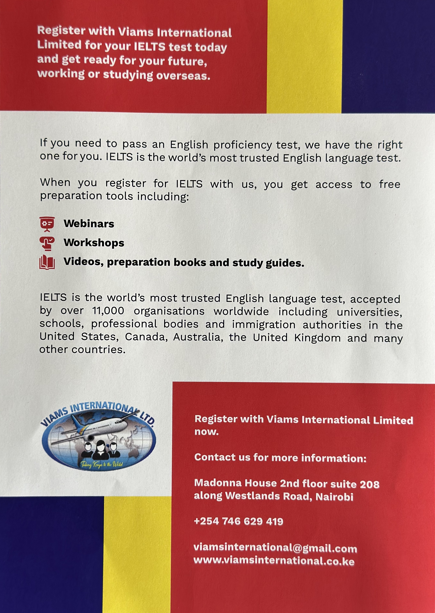

import imageAngelaFisher from '@/images/team/angela-fisher.jpg'

export const article = {
  date: '2022-12-01',
  title: 'Insiders Guide to IELTS!',
  description:
    'As an IELTS administrator at VIAMS International, I have the pleasure of seeing countless students achieve their dream scores and move on to exciting new opportunities. Today, I want to share some insider tips to help you excel in your IELTS journey',
  author: {
    name: 'Kevin Kinyanjui',
    role: 'IELTS Trainer Viams',
    
  },
}

export const metadata = {
  title: article.title,
  description: article.description,
}

## 1. Understanding the test format

First things first: familiarize yourself with the IELTS test format. The exam is divided into four sections: Listening, Reading, Writing, and Speaking. Each section has its own unique challenges, but understanding what to expect will help you prepare more effectively.

## 2. Practice Makes Perfect

Consistent practice is key. Make use of the official IELTS practice materials and consider joining a preparatory course. At VIAMS International, we offer tailored practice sessions that mimic the actual test environment, helping you build confidence and improve your skills.

## 3. Focus on your weakness
Identify your weak areas and work on them diligently. Whether it's vocabulary, grammar, or pronunciation, targeting your weaknesses will give you a balanced skill set. Our experienced instructors at VIAMS can provide personalized feedback to help you improve. 

